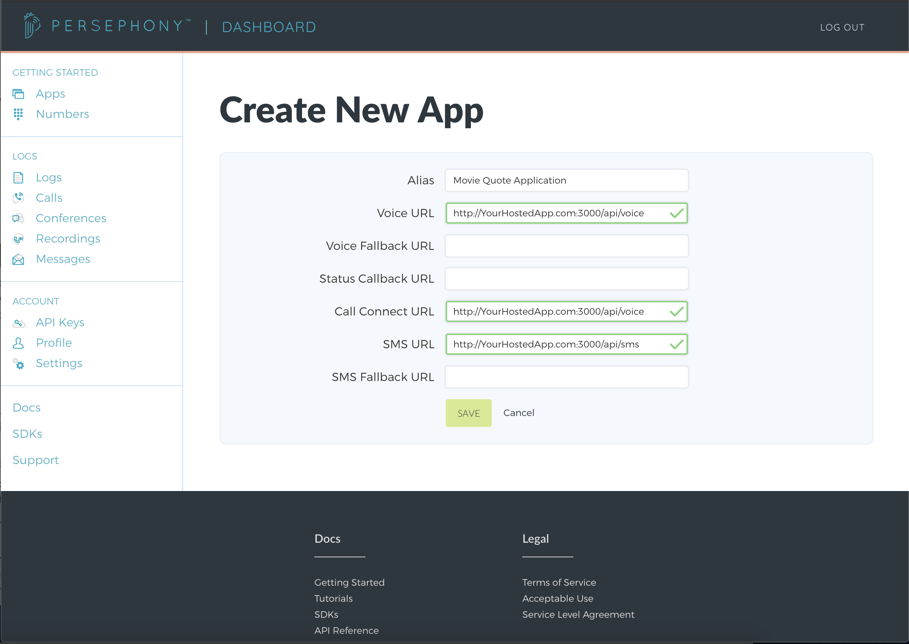
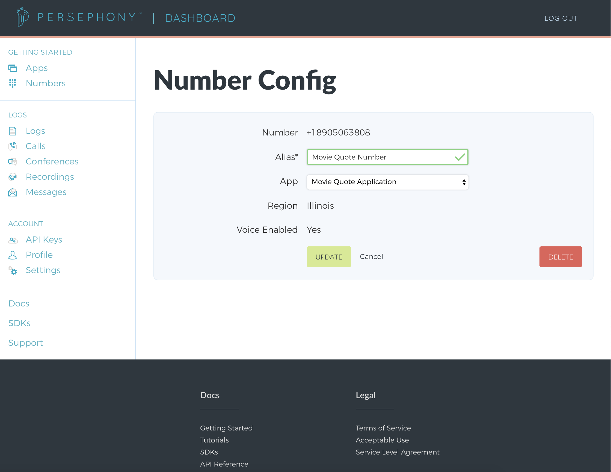

# Movie Quote Application

This project serves as a guide to help you build an application with FreeClimb. Specifically, the project will:

- Send a movie quote to a person via text message
- Respond to a text with a movie quote
- Call a person and play a movie quote
- Receive a phone call and play a movie quote

## Setting up your new app within your FreeClimb account

1. After logging into your FreeClimb account, we will [Get a FreeClimb Phone Number](https://www.freeclimb.com/dashboard/portal/numbers/buy). Users will be interacting with this phone number to receive movie quotes.
2. Next, create a new app using the [Create New App form](https://www.freeclimb.com/dashboard/portal/applications/new).

   When a phone call or text arrives to your FreeClimb phone number, FreeClimb will issue an HTTP Request to your application at a given url.

   The app's alias for this tutorial is Movie Quote Application. This tutorial will use the `Voice URL` (with endpoint `/api/voice`),`Call Connect URL` (with endpoint `/api/voice`), and `SMS URL` (with endpoint `/api/sms`).
   

3. Next, link your FreeClimb number to your FreeClimb app. Go to the [My Numbers page](https://www.freeclimb.com/dashboard/portal/numbers) and click on the number you purchased in Step 1. Set the app to your new Movie Quote Application.
   

## Setting up the Movie Quote Application locally

1. Clone or download this repo locally. To further understand the processes in this application, additional reading can be found in the [Getting Started Tutorial](https://freeclimb-docs.readme.io/docs/getting-started-with-freeclimb).

2. Install the node packages necessary using command:

   ```bash
   yarn install
   ```

3. Configure environment variables (this tutorial uses the [dotenv package](https://www.npmjs.com/package/dotenv)).

   | ENV VARIABLE            | DESCRIPTION                                                                                                                                                                   |
   | ----------------------- | ----------------------------------------------------------------------------------------------------------------------------------------------------------------------------- |
   | ACCOUNT_ID              | Account ID which can be found under [API Keys](https://www.freeclimb.com/dashboard/portal/account/authentication) in Dashboard                                               |
   | AUTH_TOKEN              | Authentication Token which can be found under [API Keys](https://www.freeclimb.com/dashboard/portal/account/authentication) in Dashboard                                     |
   | FREECLIMB_PHONE_NUMBER | FreeClimb Phone Number associated with Movie Quote Application found under [My Numbers](https://www.freeclimb.com/dashboard/portal/numbers) in Dashboard (**E.164 format**) |
   | FREECLIMB_APP_ID       | Application ID associated with FreeClimb Movie Quote Application found under [Apps](https://www.freeclimb.com/dashboard/portal/applications) in Dashboard                   |
   | HOST_URL                | URL for hosted Movie Quote Application                                                                                                                                        |

## Using the Movie Quote Application

### Responding to Incoming Calls and Texts

1. Run the application using command:

   ```bash
   $ node src/app
   Running the application on port 80.
   ```

2. Call or text your FreeClimb phone number and expect a funny movie quote in response.

### Making Outgoing Calls and Texts

1. Sending movie quote via text (where +1XXXXXXXXXX represents the E.164 formatted phone number the quote should go to):

   ```bash
   $ node src/main text +1XXXXXXXXXX
   Sent Text Message: The random quote: "I'm about to do to you what Limp Bizkit did to music in the late '90s."
   ```

2. Sending movie quote via call (where +1XXXXXXXXXX represents the E.164 formatted phone number the quote should go to):

   ```bash
   $ node src/main call +1XXXXXXXXXX
   Initiated a call using FreeClimb
   ```
